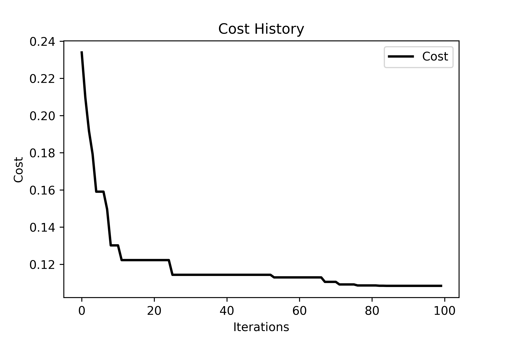

# Assessing the Transferability and Effectiveness of Groundwater Conservation Policy Under Environmental Heterogeneity

A methodological study exploring how environmental heterogeneity influences groundwater conservation and management.

## Table of Contents

- [Prerequisite](#Prerequisite)
- [Numerical Experiment Design](#Numerical-Experiment-Design)
- [Summary of Findings](#Summary-of-Findings)
- [Contributor Guide](#Contributor-Guide)

# Prerequisite

To run the simulation, you'll need to install the `py_champ` Python package. Detailed installation instructions can be found at the following link: [PyCHAMP Installation Instructions](https://github.com/philip928lin/PyCHAMP). We recommend an editable pip install:

```bash
pip install -e .
```

# Numerical Experiment Design

## Task 0
Calibration & stochastic results of our baseline model (calibrated model).

<u>Calibration:</u>
- 4 basic parameters + 5 water-yield curve parameters for "others" + 1 crop price adjustment ratio for "others."

- Particle Swarm Optimization
    - n_particles = 24
    - dimensions = 10
    - lowerbounds = [141.1518, 60.152, -2.43, 3.5254, -0.9623, 0.8, 0.5, 0.5, 0, 0]
    - upperbounds = [194.0593, 69.4979, -1.9821, 4.3674, -0.4535, 1.2, 1, 1, 0.5, 0.5]
    - hyperparameters = {"c1": 0.5, "c2": 0.5, "w": 0.8}
    - max_iter = 100
    - stochastic repetition = 3

<u>Scenarios (7):</u>
- **[idx, R00, C00, S00, 0, P00, E00, XX (7)]**
    - py_seeds = [67, 56, 78, 90, 12, 34, 47]

## Task 1
Sensitivity analysis to mean values of initial B and initial corn ratio.

<u>Scenarios (2 sets):</u>
- **mean values of initial B (8)**
    - [0.001, 0.0015, 0.002, 0.0025, 0.003, 0.0035, 0.004, 0.0045]
- **initial corn ratio (10)**
    - ['C40', 'C45', 'C50', 'C55', 'C60', 'C65', 'C70', 'C75', 'C80', 'C85']

## Task 2
How does heterogeneity (i.e., range) play a role?

<u>Scenarios (2716):</u>
- **[idx, RXX (7), CXX (55), S01, 3256, P00, E00, XX (7)]**
    - ranges = ["R03", "R07", "R11", "R15", "R19", "R24", "R28"]
    - ratios = vary with different range (with interval 0.01)
    - py_seeds = [67, 56, 78, 90, 12, 34, 47]

## Task 3
Is range a determining factor? => Variance decomposition.

<u>Scenarios (7000):</u>
- **[idx, R00, C00, SXX (10), 3256, PXX (10), EXX (10), XX (7)]**
    - sets = ['S01', 'S02', 'S03', 'S04', 'S05', 'S06', 'S07', 'S08', 'S09', 'S10']
    - prec_ids = ["P01", "P02", "P03", "P04", "P05", "P06", "P07", "P08", "P09", "P10"]
    - eco_ids = ["E01", "E02", "E03", "E04", "E05", "E06", "E07", "E08", "E09", "E10"]
    - py_seeds = [67, 56, 78, 90, 12, 34, 47]

## Task 3v2
Fixed py_seed to 67 (the calibrated one), I want to emphasize on the effect of others.

<u>Scenarios (7000):</u>
- **[idx, R00, C00, SXX (20), 3256, PXX (20), EXX (20), 67]**
    - sets = ['S01' to 'S20']
    - prec_ids = ["P01" to "P20"]
    - eco_ids = ["E01" to "E20"]

## Task 4
Could we generalize a successful water conservation case study to inform the policy potential in other regions?

<u>Scenarios (21200):</u>
- **[idx, RCXXXX (212), XXXX (1), PXX (10), EXX (10), XX (1), XXXX (1)]**
- RCXXXX ~= 212 (vary with different random seed)
- prec_ids = ["P01" to "P20"]
- eco_ids = ["E01" to "E20"]

# Summary of Findings

## Task 0: Calibration and validation results
- Both calibration and validation are good in capturing observed dynamics.




## Task 1: Evaluating the impact of initial corn ratio and aquifer properties ($B$)
- The model output is insensitive to $B$. Therefore, our analysis will focus on the initial crop distribution.


## Task 2: Quantifying the influence of initial corn ratio and distribution heterogeneity represent by a parameter called range.
- Higher range means lower heterogeneity.
- Corn ratio groups are assigned after sampling from the fitted geostatistical model.
- Initial corn ratios have dominant impacts on modeling outputs
- While not significant, optimal heterogeneity might exist.
- Dry years: higher heterogeneity is better (lower range)
- Wet years: lower heterogeneity is better (higher range)


## Task 3: Variance decomposition on three input uncertainties to test how decisive of a given range in a geostatistic model
- Internal climate variability contributes to the majority of the model output variance following by crop prices.
- The smaple uncertainty of the geostatistic model has the lowerest variance contribution, indicating once the geostatistic model is given the results are decisive.


## Task 4: Transferbility assessment through Monte Carlo simulation


# Contributor Guide
To contribute to the code development, please follow these steps using Git or other Git version control tools.

1. Fork the repository (from the owner's main branch).
2. Clone your forked repository to your local machine.
3. Check out to a new feature branch.
4. Start coding.
5. Stage the changes that you would like to contribute to the owner's repository.
6. Commit the staged changes to the local feature branch you previously created.
7. Push the local feature branch to your forked repository.
8. Go to your remote feature branch in your forked repository on GitHub.
9. From there, contact the owner before sending a pull request for the owner to review your intended contribution.
